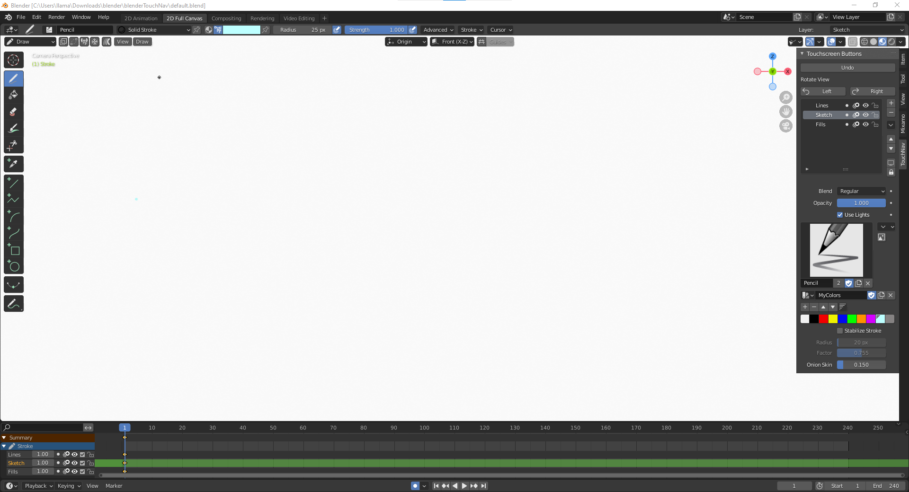

# blenderTouchNav
A blender addon to show touchscreen-friendly buttons for undo, rotate canvas, brushes plus some simplified defaults for 2D Animation.

# Concept:
This should make blender start in the most user-friendly view for drawing similar to a Krita/Photoshop interface.  
  
My teenage kids like drawing in Krita but want to animate.  They found the default 2d animation setup of Blender to be difficult and intimidating.  Mainly they like to use old surface tablets to draw without needing a keyboard...which is a challenge in Blender.  Finding certain crucial settings can be a lot to remember, for example the data properties tab to change layers in Grease Pencil. This is an attempt to give the most convenient startup and workflow possible to get drawing immediately without getting bogged down in the depths of Blender's endless options.  
  

# Installation:
*  Download the files
*  In Blender 2.8 or above go to `Edit->Preferences` and choose the `Add-ons` tab
*  Hit the `Install...` button and choose the `blender touch nav addon.py` file
*  Check the box next to the addon name to activate (3D View: Touch Navigation for 2D animation and tablets)

The "TouchNav" tab should now be visible in the 3D view sidebar.  

# Blender default file (optional):  
The other half of this setup is a blender default file to make a new 2D Animation start with the most convenient view available.  
All you need to do is open default.blend then choose `File->Defaults->Save Startup File`.  
  
It differs from the 2.93 blank 2D animation in the following ways:
*  Starts in 2D Full Canvas with TouchNav tab open
*  The greasepencil object timeline/keyframes are in the Dope Sheet window
*  Vertex Color is selected by default instead of material
*  A light blue color is selected (our preference for rough sketching)
*  3 layers are added by default to GP - Lines, Sketch, and Fills.. it starts on Sketch layer
*  Brush radius set to 25px Pencil with strength set to full
*  Same settings for 2D Animation layout
*  Object Data Properties tab is selected in the 2D animation Properties window to show layer options
*  Onion skin set to show 2 keyframes with a lower opacity (.15) and more discernable green and red colors
*  Brush Pack v2 by Daniel Martinez Lara is appended (watch out for the automatic material change, you may need to set it back to Solid Stroke after using a custom brush) 
*  A second pallette is started with primary colors
*  Output properties set to 24fps FFmpeg Video at 960x480 with MPEG-4 container and H.264 codec for 10 seconds
*  Rendered video goes to the same path as the blend file
*  Stabilize Stroke set to 20px with .755 weight

Let me know if you have any suggestions on how to make this the perfect blender startup file to keep kids & 2D animators engaged.
